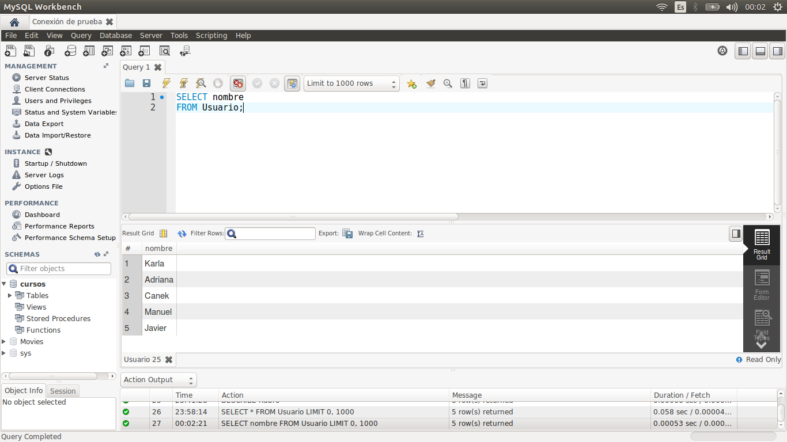
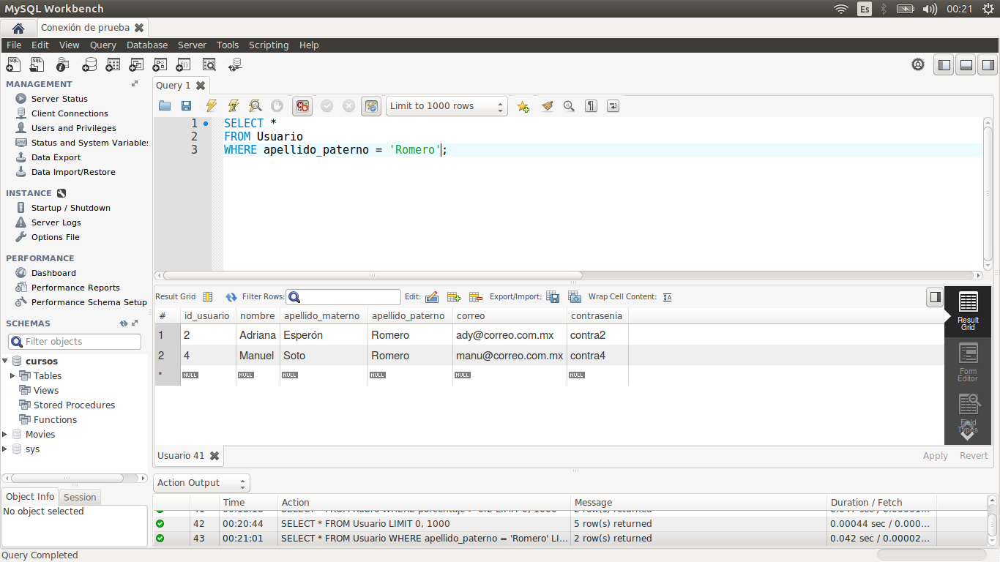
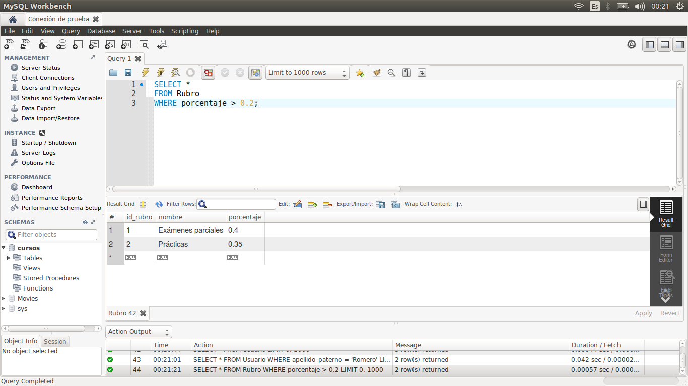
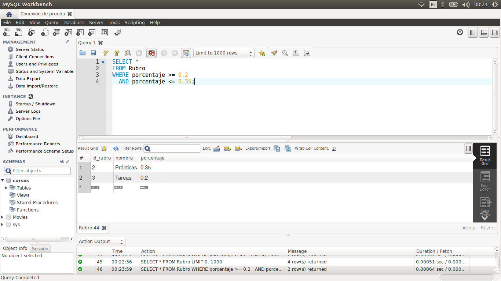
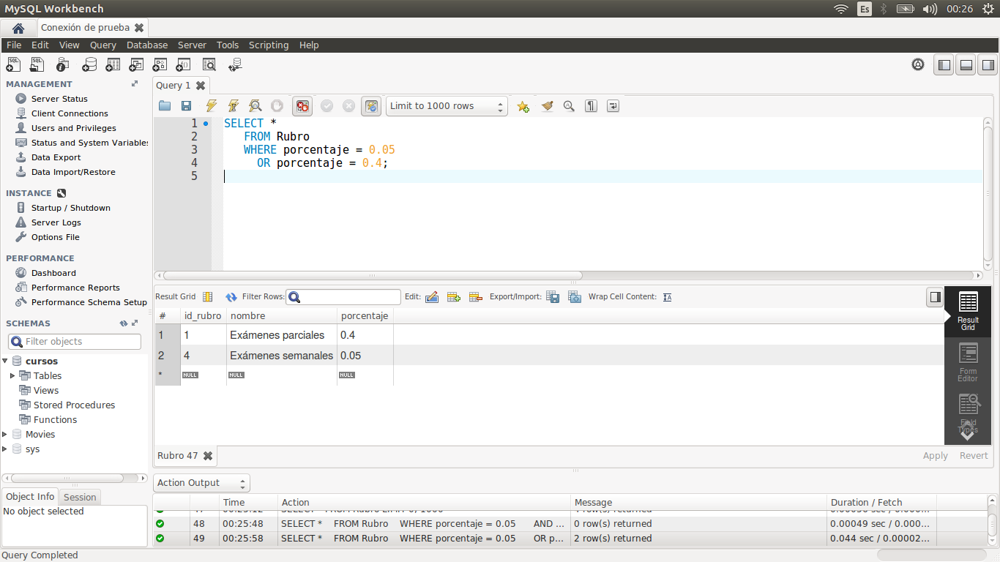
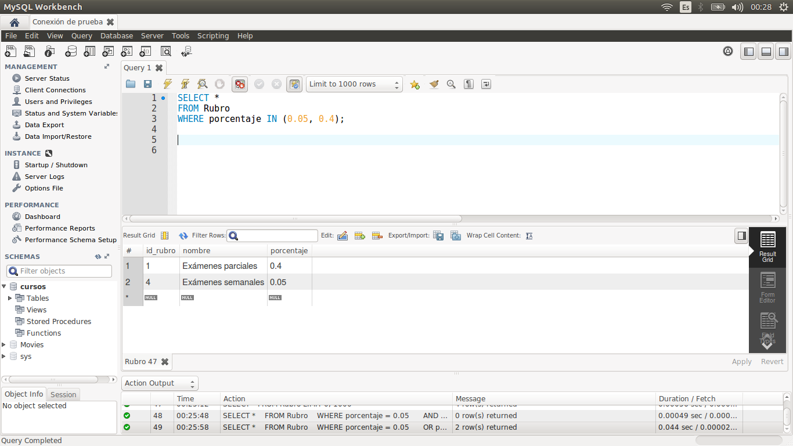

[`Introducción a Bases de Datos`](../../Readme.md) > [`Sesión 01`](../Readme.md) > `Ejemplo 03`

## Ejemplo 3: Estructura básica de una consulta

### OBJETIVO

- Aprender escribir consultas sencillas por medio de `SELECT`.
- Filtrar los resultados de un `SELECT` mediante la restricción `WHERE`.
- Ilustrar el uso de los operadores lógicos, relacionales e `IN`.

#### REQUISITOS

1. Conexión al servidor de bases de datos que se configuró en el Ejemplo 1.
2. MySQL Workbench instalado.

#### DESARROLLO

1. Como recordarás de los ejemplos anteriores, la tabla `Usuario` incluía un campo `nombre`, vamos a seleccionar (o proyectar) los registros de ese campo. Para ello, usa la instrucción:

   ```sql
   SELECT nombre
   FROM Usuario;
   ```
   
   

2. Para traer todos los campos, usamos un asterisco en vez de listar todos los campos con la siguiente *consulta*:

   ```sql
   SELECT *
   FROM Usuario;
   ```
   
   Se mostrarán las siguientes bases:
   
   

3. Ahora, filtremos todos los usuarios cuyo apellido paterno sea `Romero`. Para ello, usamos `WHERE` como sigue:

   ```sql
   SELECT *
   FROM Usuario
   WHERE apellido_paterno = 'Romero';
   ```
 
   

4. También podemos usar operadores relacionales, para filtar registros. Por ejemplo, traemos todas los rubros cuyo porcentaje es mayor a 0.2.

   ```sql
   SELECT *
   FROM Rubro
   WHERE porcentaje > 0.2;
   ```

   

5. Podemos combinar filtros, mediante operadores lógicos, por ejemplo, supongamos que queremos todos los rubros cuyo porcentaje esté entre 0.2 y 0.35, entonces usamos el operador lógico `AND`.

   ```sql
   SELECT *
   FROM Rubro
   WHERE porcentaje >= 0.2
     AND porcentaje <= 0.35;
   ```

   
   
6. También podemos usar el operador lógico `OR`. Por ejemplo, queremos todos los rubros cuyo porcentaje sea 0.05 o 0.4.

   ```sql
   SELECT *
   FROM Rubro
   WHERE porcentaje = 0.05
      OR porcentaje = 0.4;
   ```

   
   
7. Una forma de acortar el `OR` anterior es mediante `IN`. De esta forma, vemos si un campo se encuentra en un *listado de valores*. 

   ```sql
   SELECT *
   FROM Rubro
   WHERE porcentaje IN (0.05, 0.4);
   ```

      
   
