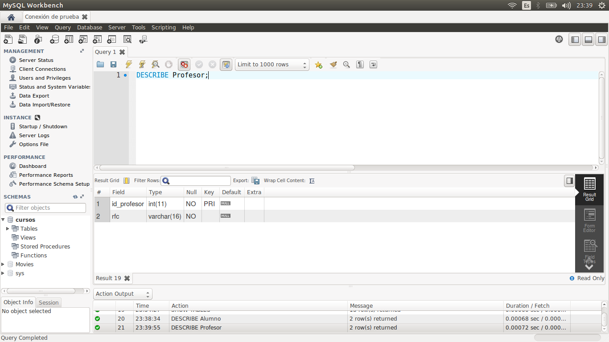
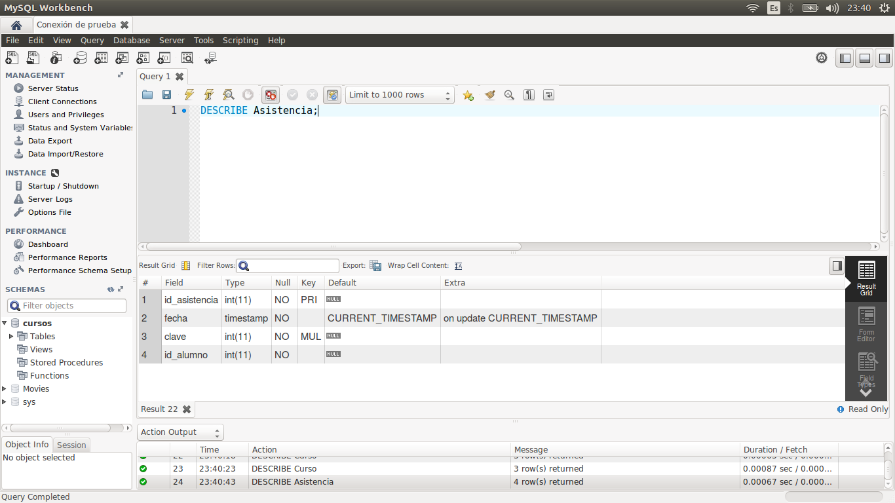

[`Introducción a Bases de Datos`](../../Readme.md) > [`Sesión 01`](../Readme.md) > `Reto 01`
	
## Estructura de una tabla

### OBJETIVO 

- Consultar la estructura de algunas tablas.

#### REQUISITOS 

1. MySQL Workbench instalado.

#### DESARROLLO

Usando la base de datos `cursos`, elige cinco tablas y muestra la descripción de cada una. Por cada tipo de dato que encuentras llena la siguiente tabla. Usa la [Documentación de MySQL](https://dev.mysql.com/doc/refman/8.0/en/data-types.html) como referencia.

| Tipo   | Descripción |
|---|---|
|   |   |

<details><summary>Solución</summary>
<p>

Veamos la descripción de las tablas `Alumno`, `Profesor`, `Curso`, `Asistencia` y `Rubro`. Recuerda que para visualizar todas las tablas del esquema puedes usar el comando:

```sql
SHOW TABLES;
```


```sql
DESCRIBE Alumno;
```


```sql
DESCRIBE Profesor;
```


```sql
DESCRIBE Curso;
```


```sql
DESCRIBE Asistencia;
```


```sql
DESCRIBE Rubro;
```


| Tipo        | Descripción                   |
|-------------|-------------------------------|
| `ìnt`       | Datos numéricos enteros       |
| `varchar`   | Cadenas de caracteres         |
| `timestamp` | Fechas                        |
| `double`    | Datos numéricos con decimales |

</p>
</details> 
