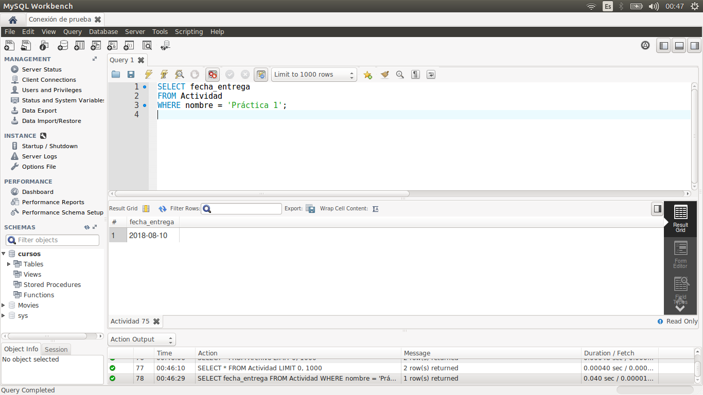
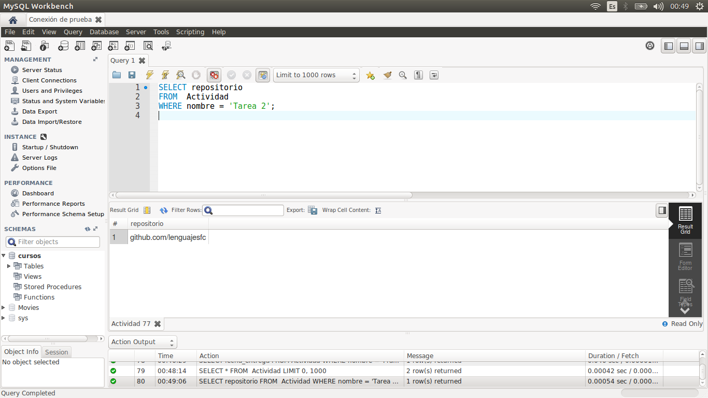
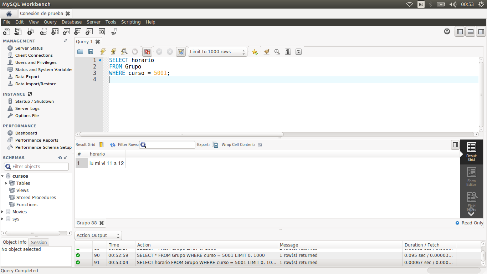
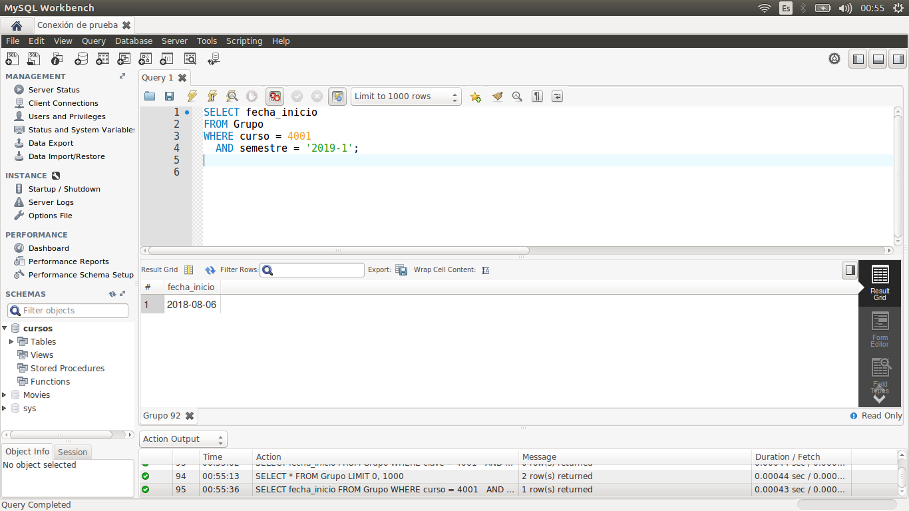

[`Introducción a Bases de Datos`](../../Readme.md) > [`Sesión 01`](../Readme.md) > `Reto 02`
	
## Estructura básica de una consulta

### OBJETIVO 

- Escribir consultas que permitan responder a algunas preguntas.

#### REQUISITOS 

1. MySQL Workbench instalado.

#### DESARROLLO

Usando la base de datos `cursos`, escribe consultas que permitan responder las siguientes preguntas.

- ¿En qué fecha se entrega la Práctica 1?
- ¿Cuál es la liga al repositorio de la Tarea 2?
- ¿Cuál es el horario de los grupos con clave de curso 5001?
- ¿Cuál es la fecha de inicio de los grupos con clave de curso 4001 durante el semestre 2019-1?
- ¿Cuál es el correo de los usuarios Karla, Adriana y Javier?

<details><summary>Solución</summary>
<p>

- ¿En qué fecha se entrega la Práctica 1?

   ```sql
   SELECT fecha_entrega
   FROM Actividad
   WHERE nombre = 'Práctica 1`;
   ```
   

- ¿Cuál es la liga al repositorio de la Tarea 2?

   ```sql
   SELECT repositorio
   FROM Actividad
   WHERE nombre = 'Tarea 2`;
   ```
   
   
- ¿Cuál es el horario de los grupos con clave de curso 5001?

   ```sql
   SELECT horario
   FROM Grupo
   WHERE curso = 5001;
   ```
    
   
- ¿Cuál es la fecha de inicio de los grupos con clave de curso 4001 durante el semestre 2019-1?

   ```sql
   SELECT fecha_inicio
   FROM Grupo
   WHERE curso = 4001
     AND semestre = '2019-1';
   ```
   
   
- ¿Cuál es el correo de los usuarios Karla, Adriana y Javier?

   ```sql
   SELECT correo
   FROM Usuario
   WHERE nombre IN ('Karla', 'Adriana', 'Javier');
   ```
   

</p>
</details> 
